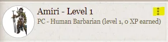
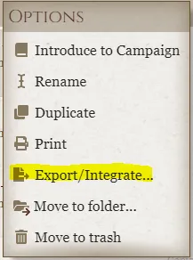
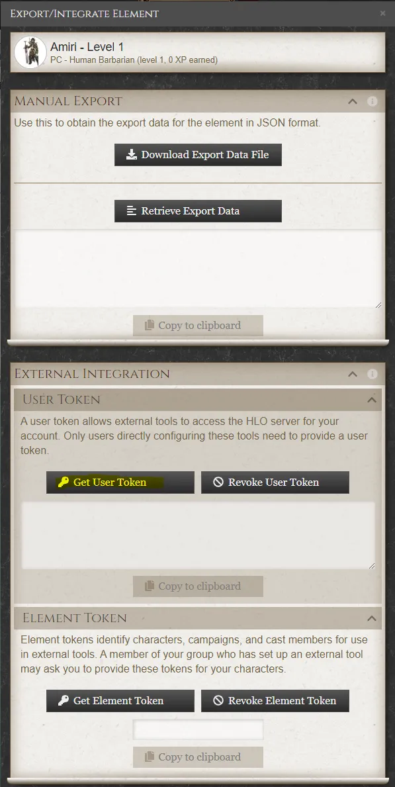
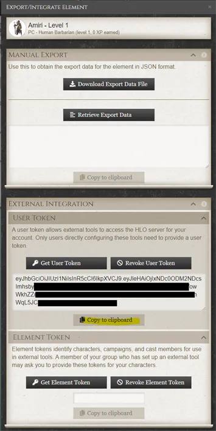
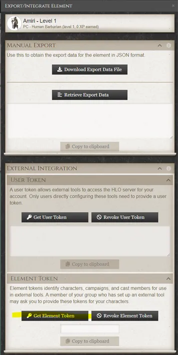
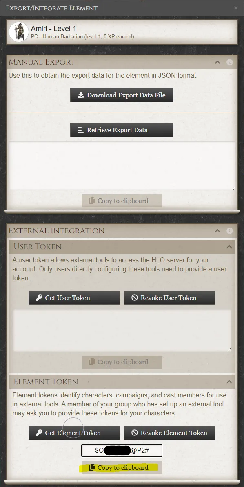

    

# Herolab Online PF2e Import Tool

A module for Foundry VTT that converts and imports Herolab Online 2e characters.

Please be aware that this module attempts to match Herolab Online items to Foundry items, and will not perform perfectly in all cases due to database differences.

## Navigation
1. [Important Note](#important-note)
2. [Guide for Importing from Herolab Online](#guide-for-importing-from-herolab-online)
3. [Getting your User Token from HLO](#getting-your-user-token-from-hlo)
4. [Getting the Element Token from HLO](#getting-the-element-token-from-hlo)
5. [Special Thanks](#special-thanks)
6. [License](#license)

## Important Note

This importer relies on my other tool, [Herolab to Foundry VTT PF2](https://github.com/zarmstrong/hlo-to-fvtt-pf2-public) to do the actual conversion process. If you have problems with the conversion, please be sure to [open a bug report on that project](https://github.com/zarmstrong/hlo-to-fvtt-pf2-public/issues).

## Guide for Importing from Herolab Online

1) Install this module or get your GM to do it in Foundry VTT.
2) Get the Element Token for the character you wish to import 
3) In *Foundry VTT* click Import from HLO, found right at the top of your character sheet next to the close button.
4) Enter the Element Token you got from Herolab Online and click import.
5) Wait about 30-45 seconds.
6) Verify the character name, class and level match your expectations. Take note of any messages from the conversion process, as you may need to make manual changes. When you're ready, click Proceed.
***
## Getting your User Token from HLO

(NOTE: If your character(s) are in a campaign, the steps are slightly different than below. In the campaign, open the character and click on the gear in the top right corner. Then follow the steps below starting at step 2)

Step 1: Click the Kebab menu on the character you wish to export 

Step 2: Click Export/Integrate 

Step 3: Click Get User Token 

Step 4: Click Copy to Clipboard 

***
## Getting the Element Token from HLO

(NOTE: If your character(s) are in a campaign, the steps are slightly different than below. In the campaign, open the character and click on the gear in the top right corner. Then follow the steps below starting at step 2)

Step 1: Click the Kebab menu on the character you wish to export 

Step 2: Click Export/Integrate 

Step 3: Click Get Element Token 

Step 4: Click Copy to Clipboard 

*** 
#### Special Thanks

Special thanks to @Doctor-Unspeakable for his [Pathbuilder module](https://github.com/Doctor-Unspeakable/foundry-pathbuilder2e-import) for being the basis of this Foundry module.

### License
This Foundry VTT module is licensed under the [MIT License](https://github.com/zarmstrong/hlo-importer/blob/main/LICENSE).
This work is licensed under [Foundry Virtual Tabletop EULA - Limited License Agreement for module development](https://foundryvtt.com/article/license/).
